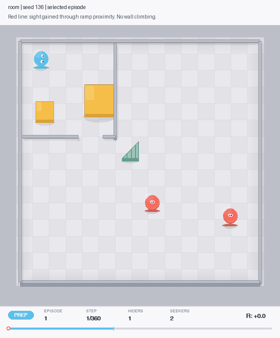

# Hide & Seek

A multi-agent reinforcement learning study built with PyTorch, PettingZoo, and Pymunk.
I implemented a 2D physics environment, PPO, self-play, and recurrent policies to explore
whether agents would learn to use movable boxes and ramps while playing hide-and-seek.

**Status: concluded study with partial results.** The saved agents sometimes position and
lock boxes near a doorway and gain sightlines by approaching a ramp. I did not demonstrate
the intended sequence of shelter construction, purposeful ramp transport, wall traversal,
and effective ramp defense.

The project began as an attempt to reproduce behaviors from
[OpenAI's 2019 hide-and-seek research](https://openai.com/index/emergent-tool-use/).
This environment uses simplified 2D mechanics and hand-designed training curricula.

## Watch the agents

<table>
<tr>
<td width="50%"></td>
<td width="50%"></td>
</tr>
<tr>
<td><b>Doorway box placement.</b> Tight-room policy, seed 10.</td>
<td><b>Ramp-assisted visibility.</b> Room policy, seed 136. The red line shows sight that disappears without elevation.</td>
</tr>
</table>

Blue agents hide; red agents seek. Orange objects are boxes; the green wedge is the ramp.
These are selected examples, not typical success rates. The evaluated ramp changes visibility
within a radius; it does not let agents cross walls. Each GIF has a matching JSON file with
its seed, checkpoint hashes, and measurements.

## Results

Fresh evaluation of the saved checkpoints: 200 episodes per configuration, seeds 0–199,
deterministic policy actions, no training spawn assists. No policies were retrained.

| Configuration | Doorway box (% episodes) | Ramp sightline (% play steps) | Hider ramp lock (% episodes) |
|---|---:|---:|---:|
| `room` | 0.0% | 12.7% | 0.0% |
| `tight-room` | 14.5% | 8.2% | 0.0% |
| `two-hiders` | 26.5% | 10.6% | 3.0% |

The doorway measure checks for a hider-locked box in a designated region. It does not test
whether the shelter is secure. The sightline measure compares visibility with and without
elevation at the same instant. A ramp lock is an observed action, not evidence of successful
defense. Percentages describe these checkpoints, not reliability across training runs.

Read the [study report](docs/study.md) for metric definitions, comparison conditions, corrected
claims, and limitations. [Raw results](results/) include all 1,800 evaluated episodes.

## Run it

Clone the repository and install the locked dependencies with [uv](https://docs.astral.sh/uv/).
The recorded evaluation used Python 3.13 on macOS ARM64 and CPU inference.

```bash
git clone https://github.com/zidankazi/hide-and-seek.git
cd hide-and-seek
uv sync --locked --python 3.13

# Quick check: two episodes in each of three conditions. No training.
uv run python evaluate.py --preset two-hiders --episodes 2

# Reproduce one illustrated episode, including a GIF and metadata.
uv run python demo.py --preset tight-room --seed 10 --output media/my-demo.gif

# Re-run the full two-hider evaluation, with comparison conditions.
uv run python evaluate.py --preset two-hiders --episodes 200 --output results/my-run.json
```

Other presets: `room` and `tight-room`. The default loads the historical save-best pair;
`--final` selects the final pair explicitly. Evaluation fails if requested weights are missing.
Exact numeric agreement across operating systems and library versions is not guaranteed.

Open [walkthrough.ipynb](walkthrough.ipynb) for the guided tour. Its optional code cells load
saved policies; none starts training. To execute them in VS Code or another notebook editor,
run `uv sync --locked --extra notebook` and select this repository's `.venv` as the kernel.

## What I built

- A physics environment with partial observations, team visibility rewards, movable objects,
  locks, preparation time, and several room layouts.
- Continuous and recurrent PPO implementations, opponent snapshot pools for self-play, and
  batched recurrent rollouts.
- Training experiments on policy stability, memory, team composition, geometry, and curricula.
- Seeded checkpoint evaluation and replayable demonstrations, including a correction to an
  early metric that counted ramp proximity as tool use.

## Repository guide

```text
README.md              Overview and quick start
walkthrough.ipynb      Guided tour with optional evaluation cells
evaluate.py            Supported checkpoint evaluation command
demo.py                Replay a specified episode
hide_and_seek/         Environment, PPO, and renderer modules
checkpoints/           Saved weights; study prefixes listed inside
results/               Evaluation records and provenance
media/                 Current demos and their metadata
docs/                  Study report and experiment index
experiments/           Historical scripts, logs, and media
tests/                 Measurement and replay checks
NOTES.md               Historical development journal
```

| Start here | Purpose |
|---|---|
| [`evaluate.py`](evaluate.py) | Supported evaluation entry point and study presets |
| [`demo.py`](demo.py) | Replay a specified episode as a GIF |
| [`docs/study.md`](docs/study.md) | Findings, definitions, and limits |
| [`results/`](results/) | Recorded measurements and provenance |
| [`env_hs.py`](hide_and_seek/env_hs.py) | Hide-and-seek environment |
| [`ppo_recurrent.py`](hide_and_seek/ppo_recurrent.py) | Recurrent PPO implementation |
| [`tests/`](tests/) | Measurement and reproducibility checks |
| [`NOTES.md`](NOTES.md) | Historical journal; earlier interpretations are superseded by the report |

The numbered `train_*`, `eval_*`, and `watch_*` scripts live in `experiments/scripts/`;
training logs are in `experiments/logs/`. Saved weights live in `checkpoints/`. Use the entry
points above for the concluded study. Experimental climbing code is outside its evaluated
scope. See the [experiment index](docs/experiments.md).

To check the supported workflow:

```bash
uv sync --locked --extra dev
uv run python -m pytest tests -q
uv run ruff check evaluate.py demo.py build_notebook.py tests
uv run python build_notebook.py
```
