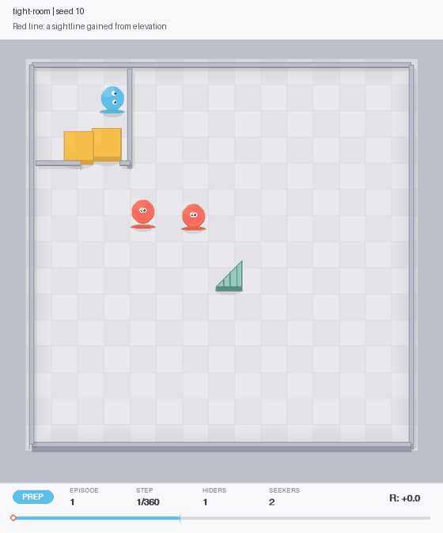

# Hide & Seek

A 2D hide-and-seek simulation with agents trained using PPO and self-play. Built with
PyTorch, PettingZoo, and Pymunk, based on [OpenAI's hide-and-seek experiments](https://openai.com/index/emergent-tool-use/).

The goal was to get hiders building shelters and seekers using ramps to reach them.
The agents learned some box placement and ramp-assisted visibility, but I couldn't get
the full sequence working. I've stopped training and kept the code, checkpoints, and results here.



Blue agents hide, red agents seek. Orange objects are boxes and the green wedge is a ramp.
This is a selected episode from the tight-room run (seed 10).

## Results

200 episodes per setup, using saved policies without training spawn assists:

| Setup | Box locked at doorway | Ramp-assisted sightline | Ramp locked by hider |
|---|---:|---:|---:|
| Room, 1 hider / 2 seekers | 0.0% | 12.7% | 0.0% |
| Tight room, 1 hider / 2 seekers | 14.5% | 8.2% | 0.0% |
| Tight room, 2 hiders / 2 seekers | 26.5% | 10.6% | 3.0% |

Box placement and locking are percentages of episodes; sightlines are a percentage of play
steps. In these runs, the ramp lets nearby agents see over walls. It doesn't let them climb
across. A box at the doorway or a locked ramp also doesn't guarantee a successful defense.

The [notebook](walkthrough.ipynb) explains the measurements and shows more examples.
[NOTES.md](NOTES.md) covers the training attempts and mistakes. Raw episode data is in [results/](results/).

## Run

Requires [uv](https://docs.astral.sh/uv/). Tested with Python 3.13 on macOS; evaluation runs on CPU.

```bash
git clone https://github.com/zidankazi/hide-and-seek.git
cd hide-and-seek
uv sync --locked --python 3.13

# Quick check, using saved weights
uv run python evaluate.py --preset two-hiders --episodes 2

# Full evaluation, including the comparison conditions
uv run python evaluate.py --preset two-hiders --episodes 200 --output results/my-run.json

# Replay the example above
uv run python demo.py --preset tight-room --seed 10 --output media/replay.gif
```

Other presets are `room` and `tight-room`. Add `--final` to load the last training snapshot
instead of the saved best pair. To run the notebook, install `uv sync --locked --extra notebook`
and select `.venv` as your kernel in VS Code or Jupyter.

## Code

- `hide_and_seek/`: environments, PPO implementations, and renderer.
- `evaluate.py`, `demo.py`: evaluation and GIF replay.
- `checkpoints/`: saved weights.
- `experiments/`: older training scripts, logs, and demos. [Index](experiments/README.md).
- `tests/`: sightline measurement and repeatability checks.

```bash
uv sync --locked --extra dev
uv run python -m pytest tests -q
```
